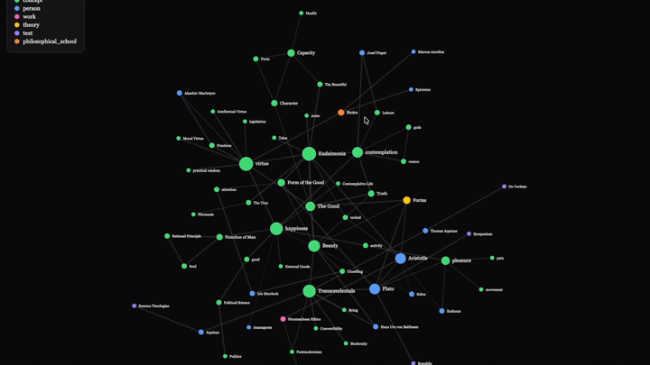

<div align="center">

# d3-knowledge-graph

**AI-powered entity extraction pipeline that transforms unstructured documents into interactive D3.js force-directed knowledge graphs.**

[](https://www.python.org/downloads/)
[](LICENSE)
[](https://www.anthropic.com)
[](https://d3js.org)
[](https://claude.com/claude-code)

<br>



<br>
<br>

*One command. Your notes become a navigable network.*

</div>

---

## How It Works

`kgraph` orchestrates a multi-stage AI pipeline that ingests raw documents and produces a live, interactive graph:

1. **Scan** — Recursively discovers `.md`, `.txt`, `.pdf`, and image files (`.jpg`, `.png`) in a target directory
2. **Extract** — Sends each document through Claude's language and vision models to identify entities (people, concepts, technologies, theories) and their relationships
3. **Cache** — SHA-256 content hashing ensures only new or modified files hit the API — unchanged documents are skipped entirely
4. **Merge** — Deduplicates entities across files (case-insensitive), merges relationship weights, and resolves category conflicts to build a unified graph
5. **Visualize** — Serves a D3.js force-directed graph with category-aware clustering, interactive hover/click inspection, and real-time search

## Installation

**Preferred (pipx):**

```
pipx install git+https://github.com/august-andersen/d3-knowledge-graph.git
```

**Alternative (pip + venv):**

```
python -m venv .venv && source .venv/bin/activate
pip install git+https://github.com/august-andersen/d3-knowledge-graph.git
```

**From source:**

```
git clone https://github.com/august-andersen/d3-knowledge-graph.git
cd d3-knowledge-graph
pipx install .
```

## API Key

Set `ANTHROPIC_API_KEY` in your environment, or run `kgraph` and paste your key when prompted. Stored in `~/.d3kg/config.json`.

## Usage

```bash
kgraph                                    # scan current directory
kgraph ./notes/                           # scan a specific directory
kgraph ./notes/ --recursive               # recurse into subdirectories
kgraph --labels                           # show relationship labels on edges
kgraph --clear-cache                      # re-extract everything from scratch
kgraph ./research/ --recursive --labels   # combine flags
kgraph --port 9090                        # custom port
```

## Supported File Types

| Format | Method |
|---|---|
| `.md` `.txt` | Direct text ingestion |
| `.pdf` | Text extraction via PyMuPDF, with automatic vision fallback for scanned/image-only pages |
| `.jpg` `.jpeg` `.png` | Claude vision — extracts concepts, diagrams, and relationships from images |

## Architecture

```
kgraph CLI
  │
  ├─ scanner     file discovery + SHA-256 hashing
  ├─ extractor   text/PDF/image content extraction
  ├─ llm         Claude API orchestration + structured JSON parsing
  ├─ graph       entity deduplication + relationship merging
  ├─ cache       persistent JSON cache (~/.d3kg/cache.json)
  └─ server      Flask → single-page D3.js dashboard
```

## Graph Controls

- **Drag** nodes to reposition (pinned on drop)
- **Scroll** to zoom, drag background to pan
- **Hover** a node to highlight its neighborhood and dim everything else
- **Click** a node for a detail card (description, source files, connections)
- **Search** to filter entities by name in real time
- **Labels** toggle edge relationship labels on/off
- **Grayscale** toggle to desaturate the visualization
- **Dark / Light** theme switcher (persists via localStorage)

## License

MIT

